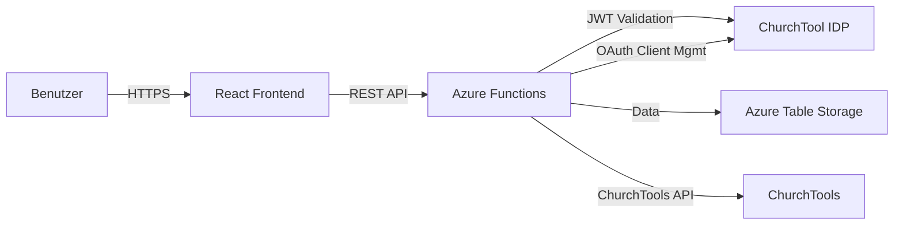
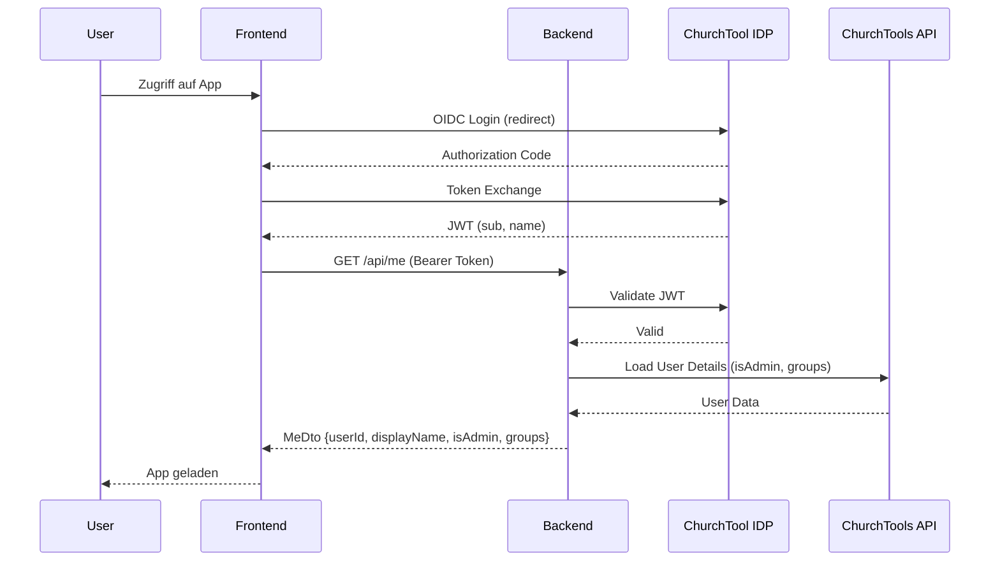

# Architektur — ct-appportal Monorepo

## Übersicht

ct-appportal ist als **Monorepo** mit npm workspaces organisiert. Das Projekt besteht aus einem React-Frontend, einem .NET Azure Functions Backend und einem gemeinsamen TypeScript-Package für Type-Definitionen.

## Monorepo-Struktur

```
ct-appportal/
├── packages/
│   ├── frontend/          # React + Vite Frontend
│   ├── backend/           # .NET 10 Azure Functions Backend
│   └── shared/            # TypeScript Types (generiert aus C# DTOs)
├── infrastructure/        # Deployment & lokale Tools
├── docs/                  # Dokumentation
├── scripts/               # Build- und Setup-Scripts
└── .github/               # GitHub-spezifische Konfiguration
```

## Tech-Stack

### Frontend (`packages/frontend/`)

| Layer | Technologie | Version |
|---|---|---|
| Framework | React | 19 |
| Build Tool | Vite | 8 |
| Sprache | TypeScript | ~6.0 |
| UI Library | FluentUI V9 | ^9.73 |
| Routing | React Router | v7 |
| State Management | TanStack Query | v5 |
| Authentication | react-oidc-context | ^3.3 |

### Backend (`packages/backend/`)

| Layer | Technologie | Version |
|---|---|---|
| Runtime | .NET | 10.0 |
| Hosting | Azure Functions | v4 (Isolated Worker) |
| HTTP Framework | ASP.NET Core | (included) |
| Table Storage | GuedesPlace.AzureTools | v1.2.2 |
| ChurchTool IDP | EaglesJungscharen.Azure.ChurchToolIDPServices | v1.0.0 |
| ChurchTool Client | Fegmm.ChurchTools | v1.0.11 |

### Shared (`packages/shared/`)

- **TypeScript** ~6.0
- Type-Definitionen automatisch generiert aus C# DTOs

## Datenfluss



## Type-Synchronisation

**C# als Source of Truth** — Frontend und Backend nutzen die gleichen Datenstrukturen:

```
Backend (C#)                             Frontend (TypeScript)
┌─────────────────┐                      ┌─────────────────────┐
│ Models/Dtos/    │                      │ @ct-appportal/      │
│  - AppDto.cs    │ ─┐                   │   shared            │
│  - MeDto.cs     │  │                   │  - AppDto          │
│  - GroupDto.cs  │  │                   │  - MeDto           │
└─────────────────┘  │                   │  - GroupDto        │
                     │                   └─────────────────────┘
                     │                            ▲
                     ▼                            │
              ┌──────────────┐                   │
              │ DtoTypeGen   │───────────────────┘
              │ (Reflection) │
              └──────────────┘
```

### Workflow

1. Backend-DTOs werden in `packages/backend/Models/Dtos/` definiert (C# `record`)
2. `DtoTypeGenerator` liest diese via .NET Reflection
3. TypeScript-Interfaces werden generiert: `packages/shared/src/generated/dtos.ts`
4. Frontend importiert: `import { AppDto } from '@eagles-jungscharen/ct-appportal-shared'`

## Authentication Flow



**Wichtig**: 
- JWT enthält **nur** `sub` und `name`
- `isAdmin` und `groups` werden **separat** aus ChurchTools API geladen
- Admin-Checks **niemals** aus JWT-Claims ableiten

## Datenzugriff

### Table Storage (Backend)

Zugriff ausschliesslich über `TypedAzureTableClient<T>` aus `GuedesPlace.AzureTools`:

```csharp
// Dependency Injection
var tableService = new ExtendedAzureTableClientService(connectionString);
tableService.CreateAndRegisterTableClient<AppEntity>("Apps");
builder.Services.AddSingleton(tableService);

// Verwendung
var result = await tableClient.GetByIdAsync(id);
await tableClient.InsertOrReplaceAsync(rowKey: id, partitionKey: "App", entity);
```

### ChurchTool API (Backend)

Via Kiota-generierter Client:

```csharp
var client = await _clientFactory.CreateClientAsync(userId);
var groups = await client.Groups.GetAsync();
```

## Error Handling

Alle API-Fehler folgen einem standardisierten Format:

```json
{
  "error": "Die Applikation wurde nicht gefunden.",
  "errorNumber": 1101
}
```

| Bereich | Nummernbereich |
|---|---|
| Allgemein / Validierung | 1000–1099 |
| Applikations-Management | 1100–1199 |
| Zuweisungen | 1200–1299 |
| IDP / Client-Registrierung | 1300–1399 |

## Development Workflow

1. **Environment Setup**: `.env.local` erstellen, `npm run generate:env` ausführen
2. **Type Generation**: `npm run generate:types` (nach Backend-DTO-Änderungen)
3. **Development**: `npm run dev` (startet Frontend + Backend parallel)
4. **Build**: `npm run build` (baut alle Packages)

## Deployment

*Siehe [DEPLOYMENT.md](DEPLOYMENT.md) für Details*

- **Frontend**: Azure Static Web Apps oder CDN
- **Backend**: Azure Functions (Linux, .NET 10 Isolated)
- **Storage**: Azure Table Storage
- **Authentication**: ChurchTool IDP (OIDC)

## Weitere Informationen

- [DEVELOPMENT.md](DEVELOPMENT.md) — Lokale Entwicklung
- [DEPLOYMENT.md](DEPLOYMENT.md) — Azure Deployment
- [MIGRATION.md](MIGRATION.md) — Monorepo-Migration
